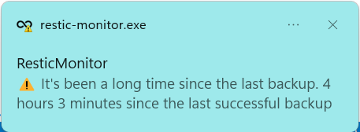
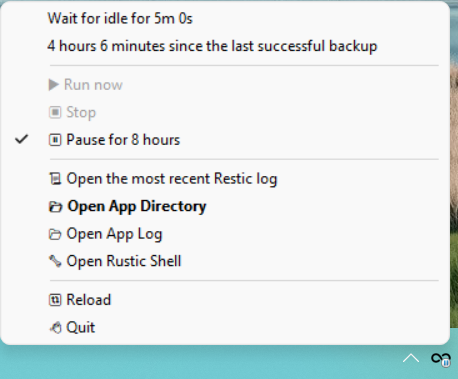

# restic-monitor

## Overview

ResticMonitor is a tray application for Windows that can start a [restic](https://restic.net/) backup when the user is idle.

## Features

* Run backup when the user's been idle for more than N seconds (configurable).
* Show warning when the computer hasn't been back up for more than N seconds (configurable).


*  Minimum time between two backups (configurable).

* Pause for 8 hours not to be interrupted by backup. This is persisted across restarts (configurable).


* Open shell with the same restic environment variable for troubleshotting/restore.

## Installation

Get the application distribution zip file, and unzip in `%LOCALAPPDATA%\restic-monitor`. The application will be under ``%LOCALAPPDATA%\restic-monitor\app`.

In order to avoid the UAC prompt every time, configure a Scheduled Task that runs on login, with highest privilege. One day the installation will be automated.

Task Settings:

1. Open `taskschd.msc`.
2. Create Task
3. Name: `restic-monitor`
4. Select **"Run only when user is logged on"**
5. Check **"Run with highest privileges"**
6. Go to **Triggers** Tab
   1. Click **New**
   2. Select **"At log on"** for "begin the task:"
   3. Click **OK**
7. Go to **Actions** Tab
   1. Click **New**
   2. Paste `%LOCALAPPDATA%\restic-monitor\app\restic-monitor.exe` in **Program/Script**.
   3. Click **OK**
8. Go to **Settings** Tab
   1. Uncheck **"Stop the task if it runs longer than"**

Create configuration files after.

### Configuration

The configuration files for the app lives in `%LOCALAPPDATA%\restic-monitor`. Find examples in [example_configs](/example_configs) directory. You must create them after installing the program.

After changing the config, click "reload" in the menu to restart the app.

**env.json**

env.json should contain the environment variables for the restic backup job. See the supported environment variables in [the doc](https://restic.readthedocs.io/en/latest/030_preparing_a_new_repo.html). Example:

```json
{
    "RESTIC_REPOSITORY": "s3:s3.amazonaws.com/bucket_name",
    "AWS_ACCESS_KEY_ID": "",
    "AWS_SECRET_ACCESS_KEY": ""
}
```

**settings.json**

`settings.json` defines the settings for the program.

1. `restic_exe`: is the location for the restic executable.
2. `args`: is an array of Strings to run the backup job.
3. `min_idle_seconds`: Minimum idle seconds before automatically running the backup. Idle seconds is defined by the seconds elapsed since the last user interaction (e.g., a keystroke or mouse movement).
4. `min_seconds_between_backups`: Minimum time between two consecutive backups.
5. `no_backup_warning_seconds`: How many seconds since the last successful backup. Successful backup is defined as when restic executable returned the exit code 0.
6. `ignore_exit_code_3`: Treat exit code 3 as success (`true` or `false`). If you don't really care about files not being backed up due to permissions issue, this can simplify the set up a lot.

Example:

```json
{
    "restic_exe": "C:\\bin\\restic.exe",
    "args": [
        "backup", 
        "-vv", 
        "--use-fs-snapshot", 
        "--iexclude-file=C:\\Users\\myuser\\OneDrive\\restic-exclude.txt",
        "C:\\",
        "C:\\Program Files (x86)\\Battle.net", 
        "C:\\Program Files (x86)\\Origin Games",
        "C:\\Program Files (x86)\\Steam",
        "C:\\Program Files (x86)\\Ubisoft"
    ],
    "min_idle_seconds": 300,
    "min_seconds_between_backups": 900,
    "no_backup_warning_seconds": 3600,
    "ignore_exit_code_3": false
}
```


## Troubleshooting

Check the app log under `%LOCALPPDATA%\logs`. App logs can also be found in the tray menu.

1. `restic-last.log` contains the log for the last restic invocation.
2. `restic-monitor.log` contains the log for the application itself.

## Tips

### Backing up User-writable directory

Usually you don't need to backup the directories like `Program Files` because they can be easily downloaded from the Internet. However, some applications (gaming software such as Steam) likes to put user saves in those directories. An easy way to list these directories to find all user-writable directories by running `accesschk -uwds Users "C:\Program Files (x86)"` (get [accesschk here](https://learn.microsoft.com/en-us/sysinternals/downloads/accesschk)). 

Then you configure `Program Files` as part of your exclude file, and then re-add the user-writable subdirectories (e.g., `Program Files (x86)\Steam`) as another "root" of the backup.

### Return code 3

Return code 3 indicates that there were files that were not backup-able. 

1. If it's a onedrive placeholder file, check "Always keep on device"
2. If it's a file that cannot be backed up, then add this to your exclude list.
3. If you don't care, set ignore_exit_code_3 to `true`.

## Reference

### Other files

1. `lock`: prevents two instances from running at the same time.
2. `pause_until.txt`: stores the pause until time.
3. `restic-last-successful.marker`: its last modification indicates the last successful run.
4. `logs`: contains the log files.
   1. `restic-monitor.log`, `restic-monitor.log.*`: application log
   2. `restic-last.log`: contains the log for the last restic invocation.

### How is the idle time calculated?

[GetLastInputInfo](https://learn.microsoft.com/en-us/windows/win32/api/winuser/nf-winuser-getlastinputinfo) is used to calculate the idle time.

## Development

### Running the program

Inside `poetry shell`, run `py main.py --debug`

### Building the executable

`pyinstaller main.spec -y` will produce the distributable package under `dist/app`, which can be dumped into the installation directory.

## Attribution

* main.ico from [ionicons](https://github.com/ionic-team/ionicons).